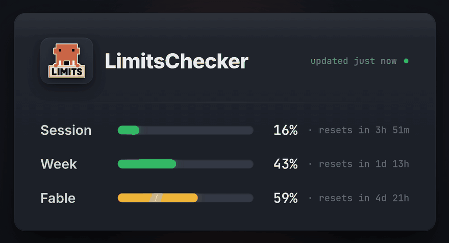
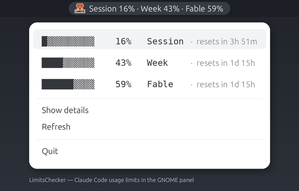

# LimitsChecker



A GNOME/AppIndicator tray indicator for **Claude Code usage limits** (with a
macOS menu-bar version — see [`macos/`](macos/)).

A Claude-focused rework of [codexbar-gnome](https://github.com/antonshalin76/codexbar-gnome).
Unlike the original, it does **not** shell out to the `codexbar` CLI — it reads the
Claude OAuth token straight from `~/.claude/.credentials.json` and queries the
Anthropic usage endpoint directly. The only runtime dependencies are Python +
GTK/AppIndicator (and `zenity` for the details window).



It shows the limits Claude Code exposes in `/usage`, in the GNOME top bar:

- `Session` — 5-hour rolling session window
- `Week`    — 7-day **weekly** (all usage) window
- `<model>` — 7-day **per-model** weekly window, when one is active

Example panel text:

```text
Session 5% · Week 42% · Fable 59%
```

A leading `⚠ ` appears when any window crosses the warn threshold (default 80%)
or reports a non-normal severity. The drop-down menu shows each window as a text
progress bar with a reset countdown, aligned into columns:

```text
█▒▒▒▒▒▒▒▒▒     5%   Session   ·  resets in 4h 37m
████▒▒▒▒▒▒    42%    Week     ·  resets in 1d 15h
██████▒▒▒▒    59%    Fable    ·  resets in 1d 15h
```

**Middle-click** the tray icon to refresh immediately; **Show details** opens the
raw JSON.

> Why a text bar and not a real widget? An AppIndicator menu is serialized to
> GNOME Shell over **DBusMenu**, which carries item text/icons only — a
> `Gtk.ProgressBar` renders blank, and color spans are dropped. So the bar is
> block glyphs (`█` filled + `▒` remaining), and columns are aligned by leading
> each row with the fixed-width bar and measuring name widths with Pango.

## How it works

```
GET https://api.anthropic.com/api/oauth/usage
Authorization: Bearer <accessToken from ~/.claude/.credentials.json>
anthropic-beta: oauth-2025-04-20
```

The response's `limits[]` array is the primary source (`session`, `weekly_all`,
`weekly_scoped`); `five_hour` / `seven_day` are used as a fallback. The token is
re-read from disk on **every** poll, so when Claude Code refreshes it in the
background the indicator picks up the new one without a restart. A dead token is
reported via the endpoint's 401 (re-login to Claude). The OAuth token must carry
the `user:profile` scope (Claude Code logins do).

## Requirements

- GNOME Shell with AppIndicator support
  - Ubuntu enables `ubuntu-appindicators@ubuntu.com` by default.
- Python 3 with GObject introspection and an AppIndicator typelib:
  - `python3-gi`
  - `gir1.2-gtk-3.0`
  - `gir1.2-ayatanaappindicator3-0.1` (or the classic `gir1.2-appindicator3-0.1`)
- `zenity` for the details window
- Claude Code logged in (so `~/.claude/.credentials.json` exists)

On Ubuntu:

```bash
sudo apt install python3-gi gir1.2-gtk-3.0 gir1.2-ayatanaappindicator3-0.1 zenity
```

## Install

```bash
sh install.sh
gtk-launch claudebar-gnome-indicator
```

The installer writes:

- `~/.local/bin/claudebar-gnome-indicator`
- `~/.local/share/applications/claudebar-gnome-indicator.desktop`
- `~/.config/autostart/claudebar-gnome-indicator.desktop`
- `~/.config/claudebar-gnome/icon.png` (bundled mascot; skipped if you already have one)

### Custom tray icon

Drop your own icon at `~/.config/claudebar-gnome/icon.svg` (or `icon.png`), or
point `CLAUDEBAR_ICON` at an absolute path. It is picked up automatically,
including on autostart. Without one, a themed system icon is used.

## Runtime options

Environment variables:

| Variable | Default | Meaning |
| --- | --- | --- |
| `CLAUDEBAR_CREDENTIALS` | `~/.claude/.credentials.json` | Path to Claude OAuth credentials |
| `CLAUDEBAR_ENDPOINT` | `https://api.anthropic.com/api/oauth/usage` | Usage endpoint |
| `CLAUDEBAR_BETA` | `oauth-2025-04-20` | `anthropic-beta` header value |
| `CLAUDEBAR_REFRESH_SECONDS` | `60` | Refresh interval in seconds (floor 5) |
| `CLAUDEBAR_TIMEOUT` | `30` | HTTP timeout, seconds (min 1) |
| `CLAUDEBAR_WARN_PERCENT` | `80` | Threshold (0–100) for the `⚠` badge |
| `CLAUDEBAR_SHOW_SCOPED` | `1` | Show the active per-model weekly window in the panel |
| `CLAUDEBAR_BAR_WIDTH` | `10` | Progress-bar width in glyphs |
| `CLAUDEBAR_FILL_CHAR` / `CLAUDEBAR_TRACK_CHAR` | `█` / `▒` | Bar glyphs |
| `CLAUDEBAR_NAME_SESSION` / `CLAUDEBAR_NAME_WEEK` | `Session` / `Week` | Window labels |
| `CLAUDEBAR_ICON` | _(bundled/themed)_ | Absolute path to a custom tray icon |
| `CLAUDEBAR_TITLE` | `LimitsChecker` | Accessible title / details window title |

Bad values fall back to the default and clamp, so a stray env var can't stop the
app from starting under autostart.

## Verify

```bash
# syntax
python3 -m py_compile bin/claudebar-gnome-indicator

# raw usage data
python3 - <<'PY'
import json, urllib.request, pathlib
tok = json.load(open(pathlib.Path.home()/".claude/.credentials.json"))["claudeAiOauth"]["accessToken"]
req = urllib.request.Request("https://api.anthropic.com/api/oauth/usage",
    headers={"Authorization": f"Bearer {tok}", "anthropic-beta": "oauth-2025-04-20"})
print(json.dumps(json.load(urllib.request.urlopen(req)), indent=2))
PY
```

## Uninstall

```bash
sh uninstall.sh
```

## macOS

A menu-bar version (same data layer, rendered with `rumps`) lives in
[`macos/`](macos/):

```bash
pip3 install rumps
python3 macos/limitschecker.py
```

On macOS the OAuth token is usually in the login Keychain rather than a file —
see [`macos/README.md`](macos/README.md) for the token-source note. (Not yet
verified on a Mac — feedback welcome.)

## License

MIT
